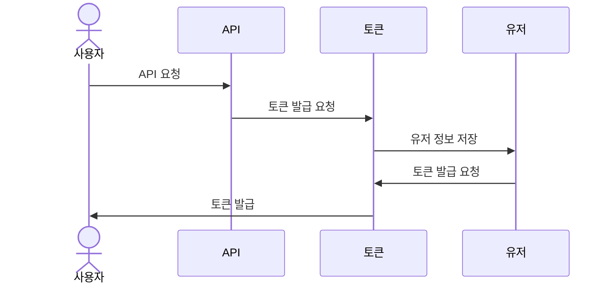
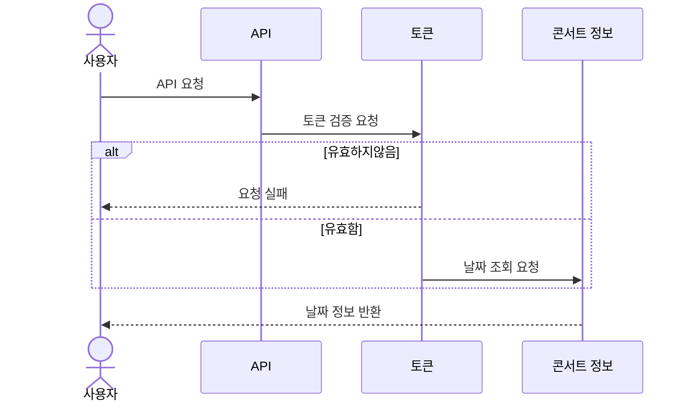
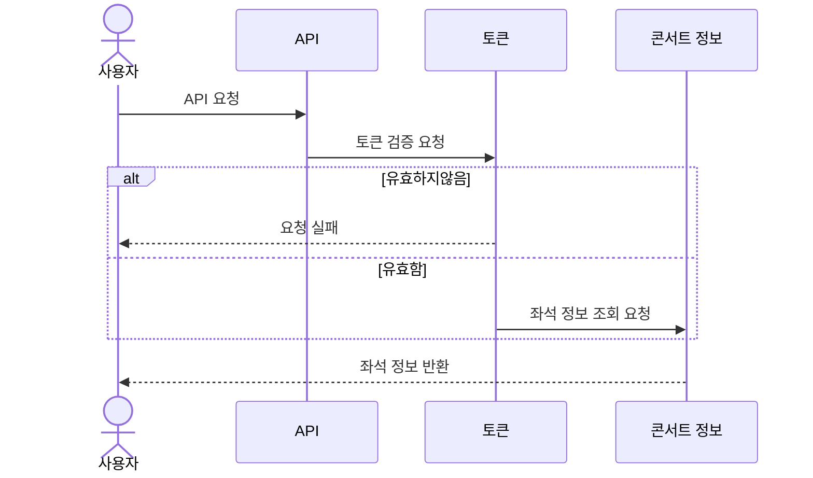
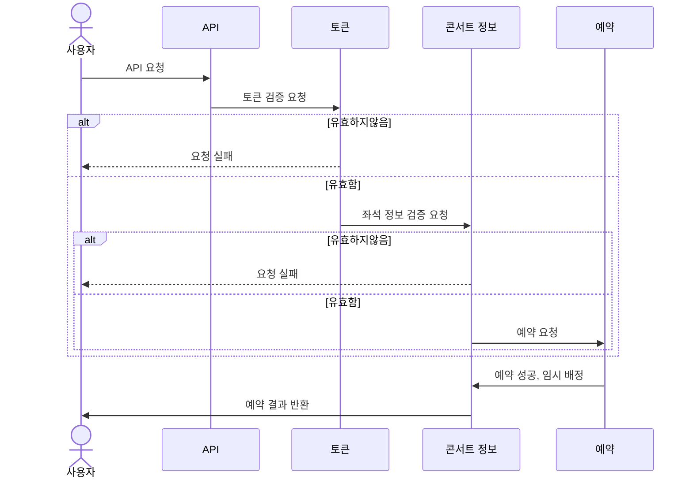
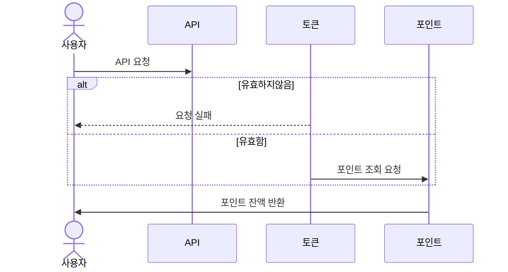
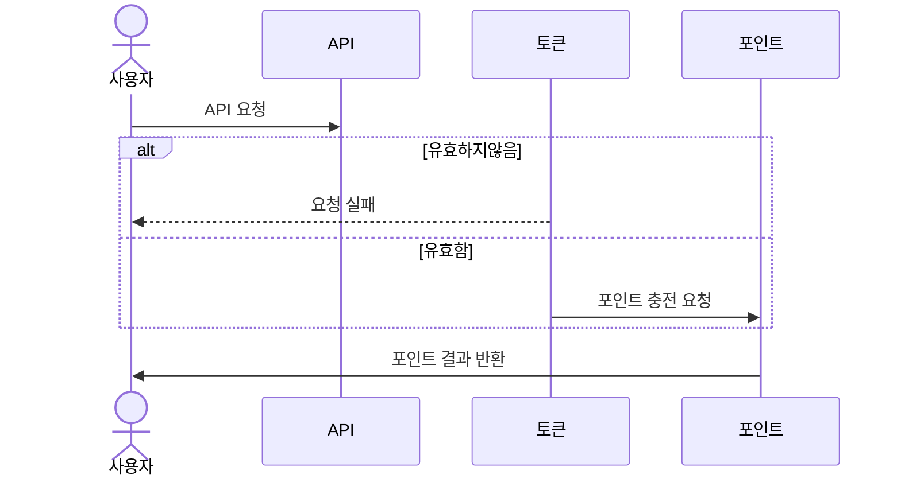
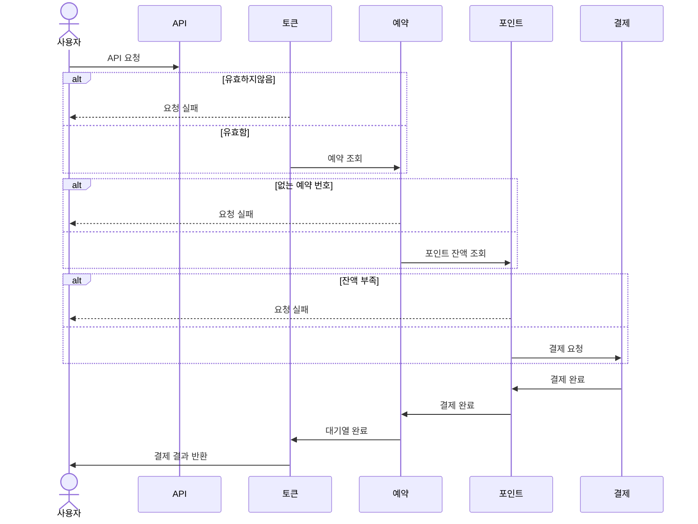

# 콘서트 예약 서비스

## Milestone

> https://ryanwolf.notion.site/87ca3ab5e48e43f4bfb8ccd3f43784cd?v=101604bb36ac4b8081a4382b76c39bc9&pvs=4

## API 명세서
> https://ryanwolf.notion.site/API-3078289affc84517b75fd1c11590e3b1?pvs=4

## 시퀸스 다이어그램 작성
### 토큰 발급 API [POST] /client/token

### 콘서트 예약 가능 날짜 조회 API [GET] /concerts/{concertId}/dates

### 콘서트 좌석 정보 조회 API [GET] /concerts/{concertId}/dates/{concertDateId}/seats

### 콘서트 좌석 예매 API [POST] /reservation

### 잔액 조회 API [GET] /client/{clientId}/balance

### 잔액 충전 API [PATCH] /user/{userId}/charge

### 결제 요청 API [POST] /payment/{paymentId}

## ERD
 
