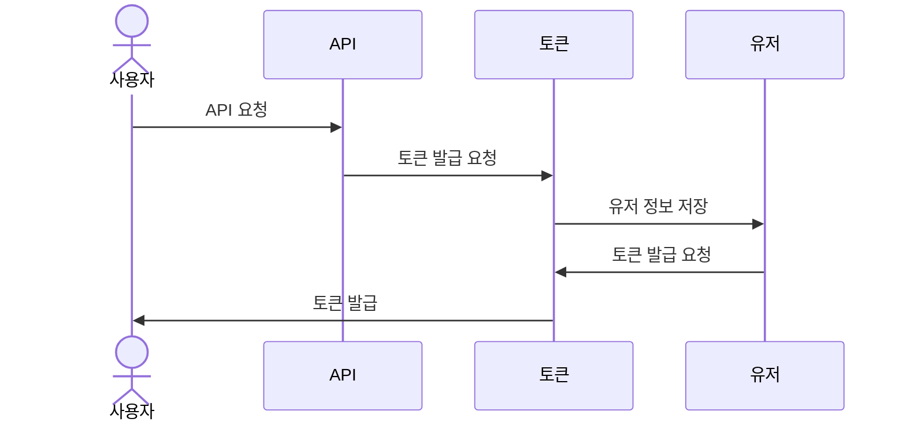
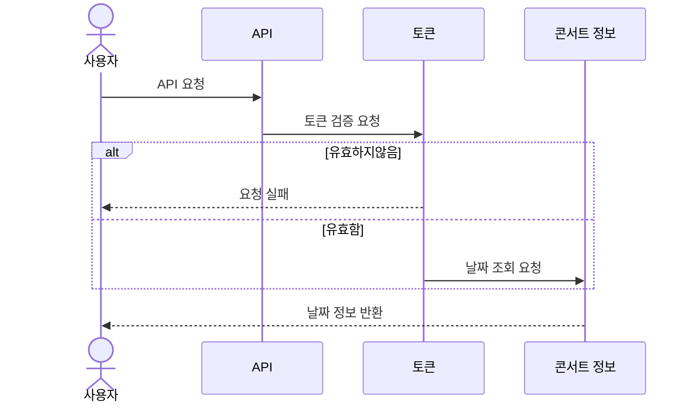
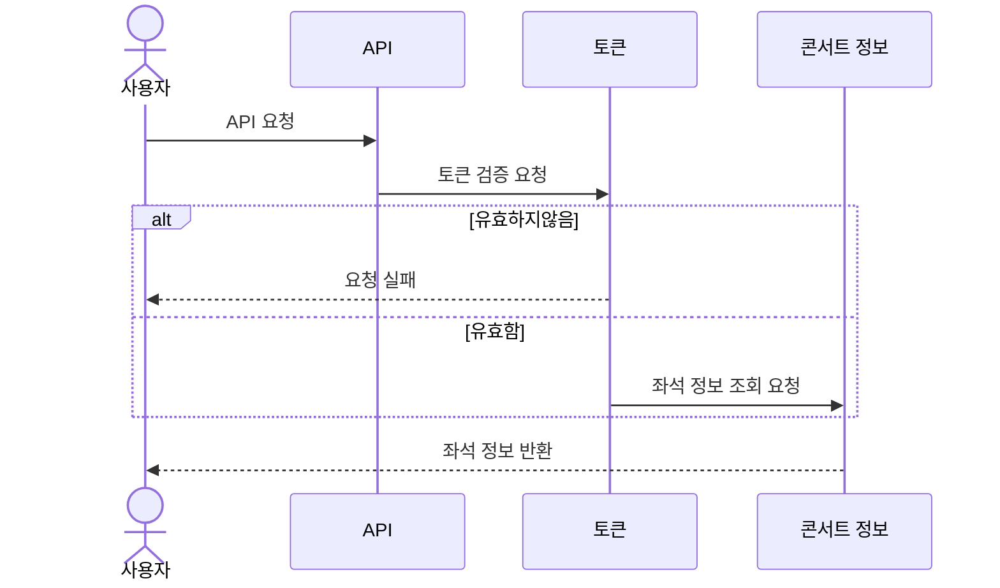
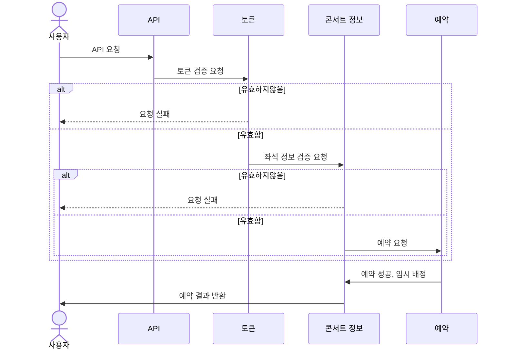
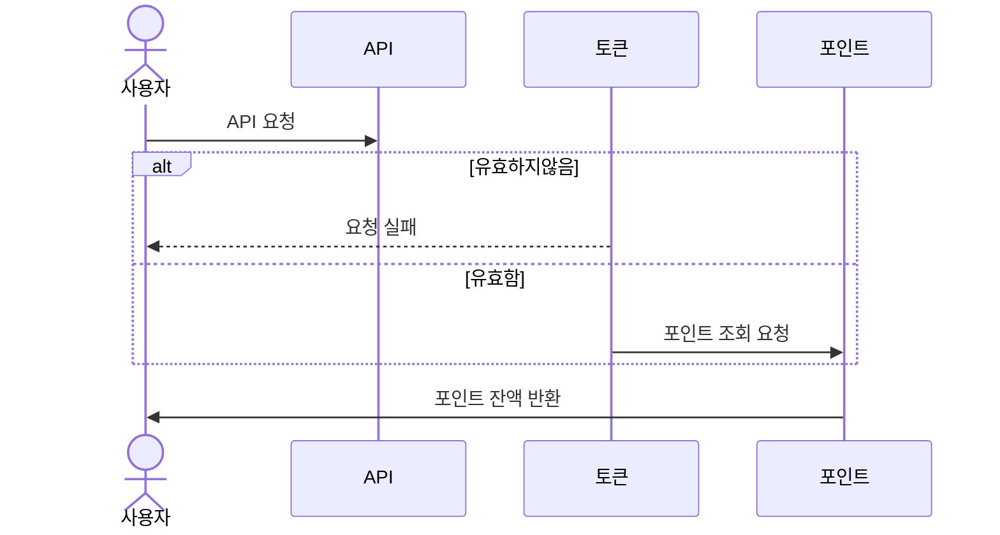
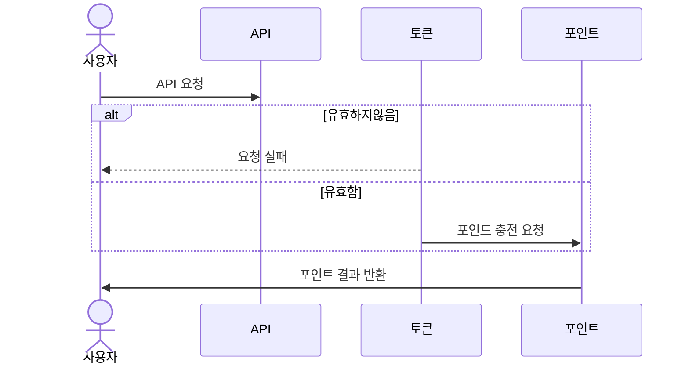
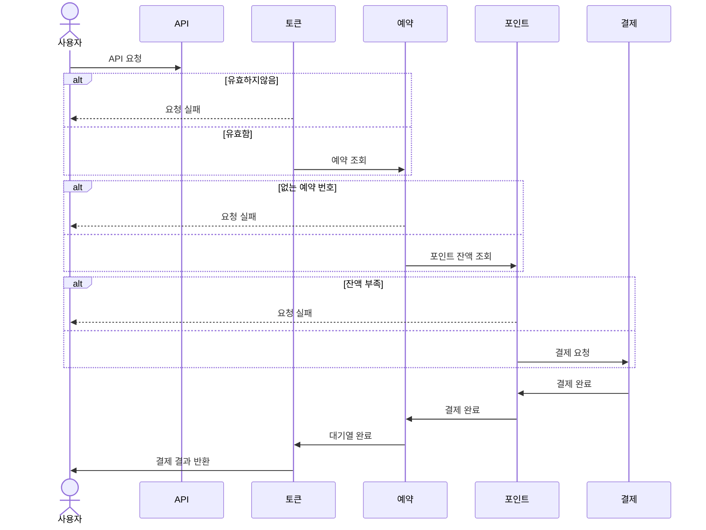

# 콘서트 예약 서비스

## 개요

대용량 트래픽이 예상되는 콘서트 예약 시스템을 위한 백엔드 애플리케이션입니다. 본 시스템은 다수의 서버 인스턴스 환경에서도 동시성 문제를 방지하고 안정적으로 작동할 수 있도록 설계되었습니다. 대기열을 이용한 유저
유입량 조절을 통해 서버 부하를 줄이고 효율적인 콘서트 예약 기능을 지원합니다.

## 주요 기능

- 대기열 시스템: 동시성 문제 해결을 위한 유저 대기열 관리
- 예약 기능: 예약 가능 날짜 및 좌석 조회, 좌석 예약 요청
- 결제 기능: 예약된 좌석에 대한 결제 처리
- 사용자 인증: JWT 기반 사용자 인증
- 포인트 관리: 잔액 충전 및 조회 기능

## 기술 스택

- 백엔드: NestJS, TypeScript
- 데이터베이스: PostgreSQL, TypeORM
- 테스트: Jest (Unit, Integration, e2e)
- 패키지관리: npm

## 요구 사항

- 각 기능 및 제약사항에 대해 단위 테스트를 반드시 하나 이상 작성하도록 합니다.
- 다수의 인스턴스로 어플리케이션이 동작하더라도 기능에 문제가 없도록 작성하도록 합니다.
- 동시성 이슈를 고려하여 구현합니다.
- 대기열 개념을 고려해 구현합니다.

## API 목록

- 유저 토큰 발급 API (`POST /users/queue`)
- 예약 가능 날짜 조회 API (`GET /concerts/:concertId/schedules/bookable`)
- 예약 가능 좌석 조회 API (`GET /concerts/schedules/:concertScheduleId/seats`)
- 좌석 예약 요청 API (`POST /concerts/seats/:concertSeatId/book`)
- 결제 API (`POST /concerts/bookings/:concertBookingId/pay`)
- 잔액 충전 API (`POST /points/charge`)
- 잔액 조회 API (`GET /points`)

## Milestone


> https://ryanwolf.notion.site/87ca3ab5e48e43f4bfb8ccd3f43784cd?v=101604bb36ac4b8081a4382b76c39bc9&pvs=4

## API 명세서

> https://ryanwolf.notion.site/API-3078289affc84517b75fd1c11590e3b1?pvs=4

## 시퀸스 다이어그램 작성

### 토큰 발급 API [POST] /client/token



### 콘서트 예약 가능 날짜 조회 API [GET] /concerts/{concertId}/dates



### 콘서트 좌석 정보 조회 API [GET] /concerts/{concertId}/dates/{concertDateId}/seats



### 콘서트 좌석 예매 API [POST] /reservation



### 잔액 조회 API [GET] /client/{clientId}/balance



### 잔액 충전 API [PATCH] /user/{userId}/charge



### 결제 요청 API [POST] /payment/{paymentId}



## ERD


# 동시성 처리 보고서

## 전체 API 종류

- 토큰 발급
- 대기 상태 조회API
- 포인트 조회
    - 한 유저가 포인트 충전과 조회 API 를 동시에 요청하는 상황이 발생하기 어렵다고 판단되어 동시성 처리 X.
- 잔액 충전
    - 충전과 결제 API 를 동시에 요청하는 상황이 발생하기 어렵다고 판단되어 동시성 처리 X.
- 콘서트 목록 조회
- 콘서트 날짜 조회
- 콘서트 좌석 정보 조회
    - 좌석 조회 시 정합성을 고려하여 s-lock 을 고려했지만 예약이 우선 순위라 판단하여 따로 lock 처리를 X
- 콘서트 좌석 예약
- 결제 요청

## 동시성 대비가 필요한 API

### 콘서트 예약 API

- 동시성 이슈 발생 가능 사례
    - 하나의 좌석에 대해 여러명이 예약하려는 경우
- 최종적으로 낙관적락 사용
    - redis 의 simple_lock 도 고려해보았지만 아래와 같은 이유로 기각(굳이 사용할만큼의 장점이 없음)
        - 추가적인 리소스 필요
        - 추가적인 처리 필요

1. 트랜잭션만 있는 경우
   
   

2. 낙관적 락 구현
   
   

3. 비관적 락
   
   

4. reids_simple_lock
   
   

5. redis_spin_lock
   
   

### 결제 API

- 동시성 이슈 발생 가능 사례
    - 유저가 순간적으로 여러번 클릭하여 여러번 결제 요청하는 경우
- 최종적으로 낙관적락 사용
    - 한건만 처리하고 나머지 실패해야하는 경우이기에 낙관적 락으로 구현

1. 트랜잭션만 있는 경우
   
   

2. 낙관적 락 구현
   
   

3. 비관적 락
    1. 결제 로직 중 예약하지 5분이 지났을 경우 에러 처리 및 좌석을 판매 상태로 변경하는 기능이 있음
    2. 좌석 상태 update 부분에서 데드락 이슈 발견
        1. inner join 사용 lock 걸 경우 관련 row 들도 같이 lock이 걸림 → 따라서 데드락
        2. 트랜잭션 없이 업데이트 시도해볼까 했으나 트랜잭션 안에서 트랜잭션으로 실행 안하면 쿼리 처리 완료가 안되는것 확인
    3. 해결법 : 비관적 락 적용할 row 와 필요없는 row 구분
    4. 허재 코치님이 말씀하신 realation 의 불편함, 직접 쿼리 확인 필요성 모두 체감 (그저 갓재)
       
       

 
# 캐시를 사용한 부하 줄이기

## 캐싱 처리가 필요한 API 선정

### 캐싱 처리시 고려해야할 요소

1. **데이터베이스 쿼리 결과**
    - **빈번하게 요청되는 데이터**: 자주 조회되지만 잘 변하지 않는 데이터.
    - **복잡한 쿼리 결과**: 계산이나 집계가 복잡한 쿼리 결과를 캐싱.
2. **API 응답**
    - **자주 호출되는 API 응답**: 동일한 요청에 대해 동일한 응답을 반환하는 경우.
    - **외부 서비스 응답**: 외부 API 호출 결과, 외부 데이터 제공자의 응답.
3. **동적 콘텐츠**
    - **세션 데이터**: 사용자 세션에 따라 다를 수 있는 정보.
    - **사용자 맞춤형 데이터**: 특정 사용자에 대한 맞춤형 콘텐츠.
4. **계산 결과**:
    - **비용이 많이 드는 계산 결과**: 계산이 복잡하거나 시간이 많이 걸리는 결과.
    - **알고리즘 결과**: 특정 알고리즘에 의해 생성된 데이터.
5. **리소스 요청**
    - **검색 쿼리 결과**: 특정 검색어에 대한 결과.
    - **정렬 및 필터링된 리스트**: 대규모 데이터셋에서의 필터링된 결과.
6. **네트워크 요청**:
    - **API 호출 캐싱**: 서버 간 API 요청 결과를 캐싱.
    - **서버 간 데이터 동기화**: 다양한 서버 간의 데이터 동기화 및 캐싱.

| 항목           | Method | 캐싱 처리 필요 여부 | 판단 근거                                                              |
|--------------|--------|-------------|--------------------------------------------------------------------|
| 토큰 발급        | POST   | X           | POST Method 로 호출 빈도는 높지만 응답이 매번 달라짐                                |
| 포인트 조회       | GET    | X           | 호출 빈도 : 낮음, 변경 빈도 : 낮음                                             |
| 잔액 충전        | PATCH  | X           | 호출 빈도 : 낮음, 변경 빈도 : 낮음                                             |
| 콘서트 날짜 조회    | GET    | O           | 호출 빈도 : 높음, 변경 빈도 : 낮음                                             |
| 콘서트 좌석 정보 조회 | GET    | X           | 호출 빈도 : 높음, 변경 빈도 : 높음, 예약이 몰리는 시점에 캐싱 처리를 하면 데이터 정합성에 문제가 있을거라 판단 |
| 콘서트 좌석 예약    | POST   | X           | POST Method 로 호출 빈도는 높지만 응답이 매번 달라짐                                |
| 결제 요청        | POST   | X           | POST Method 로 호출 빈도는 높지만 응답이 매번 달라짐                                |

### 콘서트 날짜 조회  API

- 데이터의 신선도와 메모리 효율성을 위해 TTL 을 10분으로 설정
- 구현 로직
    - 캐시 조회
        - 있으면 캐시 데이터 리턴
        - 없으면 DB 조회 및 캐시 설정
- 테스트 결과
    - 1번 캐시 없는 상태 → 응답 시간 88ms
    - 그외 캐시 있는 상태 → 응답 시간 평균 22ms 소요
      

##

 
# 쿼리 성능 개선

## 인덱스 추가 시 고려해야할 사항

1. **쿼리 분석**
    1. 쿼리 분석은 인덱스 설계의 기초입니다. 자주 실행되는 쿼리와 쿼리의 패턴을 분석하여 필요한 인덱스를 결정합니다.
        - **쿼리의 WHERE 절**: 자주 사용되는 필터링 조건의 열에 인덱스를 추가합니다.
        - **JOIN 절**: 조인에 사용되는 열에 인덱스를 추가하여 조인 성능을 향상시킵니다.
        - **ORDER BY 절**: 정렬에 사용되는 열에 인덱스를 추가하여 정렬 성능을 개선합니다.
        - **GROUP BY 절**: 집계 함수와 함께 사용되는 열에 인덱스를 추가합니다.
2. **데이터 특성 분석**
    1. **카디널리티**
        - 데이터의 고유 값 수에 따라 인덱스의 효과가 달라집니다. 고유 값이 많은 열(고카디널리티)에 인덱스를 추가하면 효과적입니다.
    2. **데이터 분포**
        - 데이터가 균등하게 분포되지 않은 경우, 특정 열에 인덱스를 추가하여 쿼리 성능을 개선할 수 있습니다.
3. **인덱스 유형 선택 (PostgresSQL, 하지만 실제적으론 고려 안하는듯 하다. )**
    1. **B-트리 인덱스**: 기본 인덱스 유형으로, 범위 검색, 정렬, 등호 비교에 효과적입니다.

        ```
        CREATE INDEX idx_customer_id ON orders(customer_id);
        ```

    2. **해시 인덱스**: 등호 비교(=)에 최적화되어 있으며, B-트리 인덱스보다 빠를 수 있습니다.

        ```
        CREATE INDEX idx_customer_id_hash ON orders USING hash(customer_id);
        ```

    3. **GiST (Generalized Search Tree)**: 공간 데이터, 텍스트 검색 등 복잡한 쿼리에 사용됩니다.

        ```
        CREATE INDEX idx_location ON locations USING gist(geom);
        ```

    4. **GIN (Generalized Inverted Index)**: 배열, JSONB, Full-text 검색에 효과적입니다.

        ```
        CREATE INDEX idx_tags ON articles USING gin(tags);
        ```

    5. **BRIN (Block Range Indexes)**: 대량의 데이터를 효율적으로 인덱싱할 수 있으며, 테이블의 범위가 정렬된 경우 유용합니다.

        ```
        CREATE INDEX idx_date_range ON events USING brin(event_date);
        ```

   참고 https://www.postgre.org/docs/current/indexes-types.html


4. **쿼리 계획 분석**
    1. `EXPLAIN` 명령어를 사용하여 쿼리 실행 계획을 분석하고 인덱스가 사용되는지 확인합니다
        1. **예제**

            ```
            EXPLAIN SELECT * FROM orders WHERE customer_id = 12345;
            ```

        2. **출력 예시**

            ```
             Index Scan using idx_customer_id on orders  (cost=0.43..8.45 rows=1 width=123)
              Index Cond: (customer_id = 12345)
            ```

## 인덱스 추가하는 법

- PostgresSQL

  ### 1. 기본 인덱스 생성

    ```
    CREATE INDEX index_name ON table_name (column_name);
    ```

    - `index_name`: 생성할 인덱스의 이름.
    - `table_name`: 인덱스를 생성할 테이블의 이름.
    - `column_name`: 인덱스를 생성할 컬럼의 이름.

  ### 2. 복합 인덱스 생성

    ```
    CREATE INDEX index_name ON table_name (column1, column2);
    ```

  ### 3. 유니크 인덱스 생성

  인덱스가 고유한 값을 보장해야 하는 경우

    ```
    CREATE UNIQUE INDEX index_name ON table_name (column_name);
    ```

  ### 4. 표현식 기반 인덱스 생성

  컬럼의 표현식에 기반한 인덱스를 생성

    ```
    CREATE INDEX index_name ON table_name ((expression));
    ```

  예를 들어, `employees` 테이블의 `salary` 컬럼의 10%를 기준으로 인덱스를 생성하려면

    ```
    CREATE INDEX idx_employees_salary_10percent ON employees ((salary * 0.10));
    ```

  ### 5. GiST 또는 GIN 인덱스 생성

  PostgreSQL은 GiST(Generalized Search Tree)와 GIN(Generic Inverted Index)와 같은 특수한 인덱스 유형도 지원합니다. 예를 들어, 배열이나 JSONB 데이터
  타입을 인덱싱할 때 유용하다

    - **GiST 인덱스**

    ```
    CREATE INDEX index_name ON table_name USING GIST (column_name);
    ```

    - **GIN 인덱스**

    ```
    CREATE INDEX index_name ON table_name USING GIN (column_name);
    ```

  예를 들어, `documents` 테이블의 `tags` 컬럼이 배열 타입일 때 GIN 인덱스를 생성하려면:

    ```
    CREATE INDEX idx_documents_tags ON documents USING GIN (tags);
    ```

  ### 6. 인덱스 삭제

    ```
    DROP INDEX index_name;
    ```

  ### 인덱스 생성 시 `CONCURRENTLY` 사용하기

  PostgreSQL에서는 인덱스를 생성할 때 `CONCURRENTLY` 옵션을 사용하여 데이터베이스의 사용 중인 상태에서도 인덱스를 생성하거나 삭제할 수 있습니다. 이 옵션은 데이터베이스의 성능에 영향을
  최소화하면서 인덱스를 생성할 수 있도록 도와줍니다.

  `CONCURRENTLY` 옵션을 사용하면 인덱스 생성 작업이 백그라운드에서 수행되며, 데이터베이스의 다른 작업에 영향을 미치지 않습니다. 하지만 이 옵션은 인덱스 생성이 완료될 때까지 상당한 시간이 소요될 수
  있습니다.

  → 상용 DB에 사용하면 좋을것

    ```
    CREATE INDEX CONCURRENTLY index_name ON table_name (column_name);
    ```

  ### 인덱스 삭제 시 `CONCURRENTLY` 사용하기

    ```
    DROP INDEX CONCURRENTLY index_name;
    ```

  ### 주의사항

    1. **제한 사항**: `CONCURRENTLY` 옵션을 사용할 때는 `CREATE INDEX`와 `DROP INDEX` 명령어를 트랜잭션 블록 내에서 사용할 수 없습니다. 즉, 이 명령어들을 `BEGIN`
       과 `COMMIT` 사이에서 실행할 수 없습니다. 별도의 트랜잭션에서 실행해야 합니다.
    2. **성능 고려**: 인덱스 생성 과정이 장시간 소요될 수 있으며, 데이터베이스의 성능에 영향을 미칠 수 있습니다. `CONCURRENTLY` 옵션을 사용해도 인덱스 생성은 백그라운드에서 진행되지만,
       여전히 디스크 I/O와 CPU 자원을 소모합니다.
    3. **락**: `CONCURRENTLY`를 사용하더라도, 인덱스 생성 중에는 테이블에 대한 읽기 작업이 잠시 영향을 받을 수 있습니다. 쓰기 작업에는 영향을 미치지 않습니다.
    4. **다른 작업과의 호환성**: 인덱스 생성 작업이 큰 데이터베이스에서 수행될 경우, 작업 중에 데이터베이스의 다른 작업이 느려질 수 있습니다.

### 참고

- https://typeorm.io/indices#concurrent-creation
- https://www.postgre.org/docs/current/-createindex.html#SQL-CREATEINDEX-CONCURRENTLY

## 전체 API 중 조회 쿼리

## 인덱싱 필요없는 쿼리

### 토큰 발급

1. 유저 id 를 사용한 유저 정보 조회 (PK 사용으로 인덱싱 필요 X)

```
SELECT 
"User"."id" AS "User_id", 
"User"."creat_at" AS "User_creat_at", 
"User"."update_at" AS "User_update_at", 
"User"."point" AS "User_point" 
FROM "user" "User" 
WHERE (("User"."id" = $1)) LIMIT 1 -- PARAMETERS: [1]
```

### 토큰 리프레시

1. redis 사용으로 DB 조회 없음

### 포인트 조회

1. 유저 id 를 사용한 유저 포인트 조회 (PK 사용으로 인덱싱 필요 X)

```
SELECT 
"User"."point" AS "User_point", 
"User"."id" AS "User_id" 
FROM "user" "User" 
WHERE (("User"."id" = $1)) LIMIT 1 -- PARAMETERS: [1]
```

### 잔액 충전

1. 유저 id 를 사용한 유저 포인트 조회 (PK 사용으로 인덱싱 필요 X)

```
SELECT 
"User"."point" AS "User_point", 
"User"."id" AS "User_id" 
FROM "user" "User" 
WHERE (("User"."id" = $1)) LIMIT 1 -- PARAMETERS: [1]
```

### 결제

1. 결제 id 를 사용한 결제 내역 조회 (PK 사용으로 인덱싱 필요 X)

```
SELECT 
"Payment"."id" AS "Payment_id", 
"Payment"."creat_at" AS "Payment_creat_at", 
"Payment"."update_at" AS "Payment_update_at", 
"Payment"."price" AS "Payment_price", 
"Payment"."status" AS "Payment_status", 
"Payment"."user_id" AS "Payment_user_id", 
"Payment__Payment_user"."id" AS "Payment__Payment_user_id", 
"Payment__Payment_user"."creat_at" AS "Payment__Payment_user_creat_at", 
"Payment__Payment_user"."update_at" AS "Payment__Payment_user_update_at", 
"Payment__Payment_user"."point" AS "Payment__Payment_user_point" 
FROM "payment" "Payment" 
LEFT JOIN "user" "Payment__Payment_user" 
ON "Payment__Payment_user"."id"="Payment"."user_id" 
WHERE "Payment"."id" = $1; 
```

## 인덱싱 처리

### 콘서트 날짜 조회

- `concert_id` 를 사용한 스케쥴 조회
    1. 호출 빈도 : 높음
    2. 데이터량 : 많이 넣어둠 (20,000,000개)
    3. 사용된 쿼리

        ```
        SELECT * FROM "concert_schedule" "schedule" 
        WHERE "schedule"."concert_id" = $1
        ```

    4. 인덱스 생성 전
        1. Execution Time: 1191.642 ms
           

    5. `concert_id` 단일 B-트리 인덱스 생성
        1. 인덱스 생성

            ```
            CREATE INDEX idx_schedule_concert_id 
            ON concert_schedule (concert_id);
            ```

        2. 인덱스 생성 후
            1. Execution Time: 0.030 ms
               

    6. `concert_id` 단일 해쉬 인덱스 생성
        1. 인덱스 생성

            ```
            CREATE INDEX idx_schedule_concert_id 
            ON concert_schedule USING hash (concert_id) ;
            ```

        2. 인덱스 생성 후
            1. Execution Time: 0.044 ms
               

    7. `concert_id` 단일 브린 인덱스 생성
        1. 인덱스 생성

            ```
            CREATE INDEX idx_schedule_concert_id 
            ON concert_schedule USING brin (concert_id) ;
            ```

        2. 인덱스 생성 후
            1. Execution Time: 1.223 ms
               

    <aside>
    💡 3가지 타입의 인덱스를 생성했을 때 최종적으로 B-tree 인덱스를 사용하여 조회함

    </aside>

### 콘서트 좌석 정보 조회

- `status`, `update_at` 에 대한 조건 검색 후 업데이트
    1. 호출 빈도 : 높음
    2. 데이터량 : 많이 넣어둠 (10,000,000개)
    3. 사용된 쿼리

        ``` 
        UPDATE "concert_seat"
        SET "status"    = $1,
            "version"   = "version" + 1,
            "update_at" = CURRENT_TIMESTAMP
        WHERE "status" = $2
          AND "update_at" < $3 
        ```

    4. 인덱스 생성 전
        1. Execution Time: 537.835 ms
           

    5. `status`, `update_at` 복합 B-트리 인덱스 생성
        1. 인덱스 생성

            ``` 
            CREATE INDEX idx_concert_seat_status_update_at 
            ON concert_seat (status, update_at);
            ```

        2. 인덱스 생성 후
            1. Execution Time: 0.347 ms
               

    6. `schedule_id`,`status`, `update_at` 복합 B-트리 인덱스 생성
        1. 인덱스 생성

            ``` 
            CREATE INDEX idx_concert_seat_schedule_id_status_update_at 
            ON concert_seat (schedule_id,status, update_at);
            ```

        2. 인덱스 생성 후
            1. Execution Time: 15.242 ms
               

    7. `id`,`status`, `update_at` 복합 B-트리 인덱스 생성
        1. 인덱스 생성

            ``` 
            CREATE INDEX idx_concert_seat_id_status_update_at 
            ON concert_seat (id,status, update_at);
            ```

        2. 인덱스 생성 후
            1. Execution Time: 477.384 ms
               

- `schedule_id` 를 사용한 좌석 조회
    1. 호출 빈도 : 높음
    2. 데이터량 : 많이 넣어둠 (10,000,000개)
    3. 사용된 쿼리

        ``` 
        SELECT *
        FROM "concert_seat" "seat"
        WHERE "seat"."schedule_id" = 35
        ORDER BY seat_number ASC;
        ```

    4. 인덱스 생성 전
        1. Execution Time: 718.172 ms
           

    5. `schedule_id` 단일 B-트리 인덱스 생성
        1. 인덱스 생성

            ``` 
            CREATE INDEX idx_concert_seat_schedule_id ON concert_seat (schedule_id);
            ```

        2. 인덱스 생성 후
            1. Execution Time: 0.047 ms
               

    6. `schedule_id` 단일 해시 인덱스 생성
        1. 인덱스 생성

            ``` 
            CREATE INDEX idx_concert_seat_schedule_id_hash 
            ON concert_seat using hash(schedule_id);
            ```

        2. 인덱스 생성 후
            1. Execution Time: 0.057 ms
               

    7. `schedule_id`,`status`, `update_at` 복합 B-트리 인덱스 생성
        1. 인덱스 생성

            ``` 
            CREATE INDEX idx_concert_seat_schedule_id_status_update_at ON concert_seat (schedule_id,status, update_at);
            ```

        2. 인덱스 생성 후
            1. Execution Time: 14.846 ms
               

> 두 쿼리에 대한 DB 인덱스 결과를 바탕으로 해당 테이블의 추가적인 인덱스 설정이 없다면 아래와 같이 인덱스 설정하는것이 적합한것으로 생각됨

`schedule_id` 단일 해시 인덱스의 경우 order By 를 사용한 경우 데이터가 정렬이 되어있지않기때문에 성능 상 이득을 볼 수 없음

    - `status`, `update_at` 복합 B-트리 인덱스 생성
    - `schedule_id` 단일 B-트리 인덱스 생성

하나의 인덱스만 설정해야한다면

- `schedule_id`,`status`, `update_at` 복합 B-트리 인덱스 생성

>

### 콘서트 좌석 예약

- `id[]`, `status` 를 사용한 좌석
    1. 호출 빈도 : 높음
    2. 데이터량 : 많이 넣어둠 (10,000,000개)
    3. 사용된 쿼리

        ``` 
        SELECT * FROM "concert_seat" "seat" 
        WHERE id IN (1, 2) AND status = 'SALE';
        ```

    4. 인덱스 생성 전
        1. Execution Time: 0.055 ms
        2. 따로 인덱스 생성 전임에도 PK 를 활요한 인덱스 스캔을 함
           
    5. `id`, `status` 복합 B-트리 인덱스 생성
        1. 인덱스 생성

            ``` 
            CREATE INDEX idx_concert_seat_id_status ON concert_seat (id,status );
            ```

        2. 인덱스 생성 후
            1. Execution Time: 0.045 ms
               

> DB 인덱스 결과를 바탕으로 status 의 낮은 카디널리티로 인해 id, status 복합 인덱스 생성을 하지 않더라도 기본 PK 에 걸린 인덱스 만으로 충분한 조회 성능이 나온다 판단됨
>

### EXPlAIN 결과 보는 방법

https://postgresql.kr/docs/9.4/sql-explain.html

