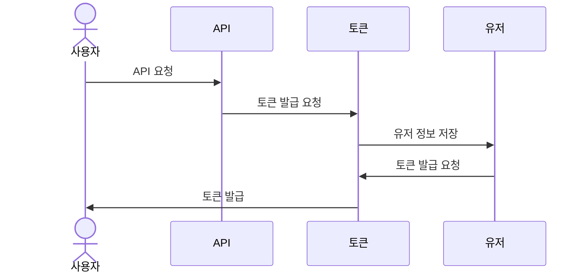
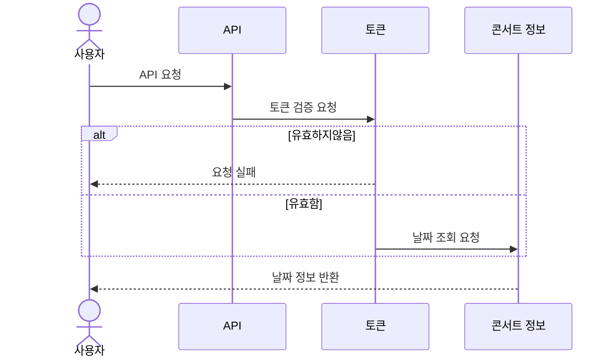
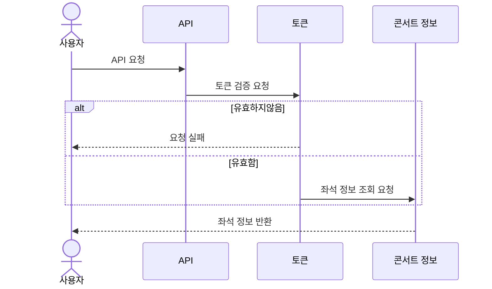
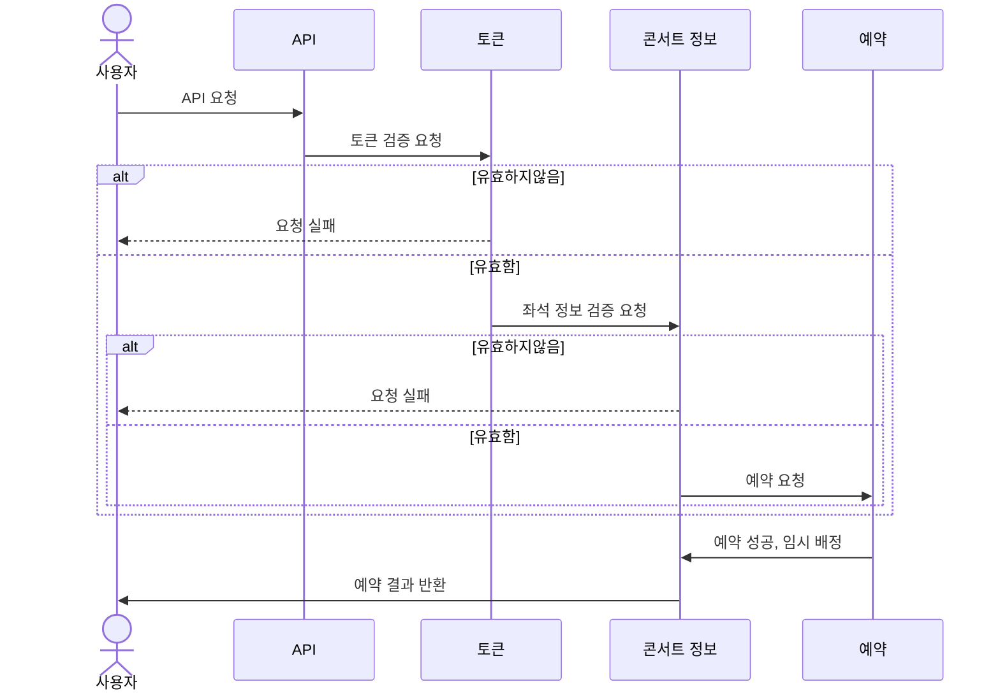
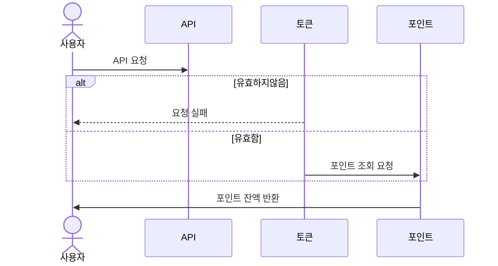
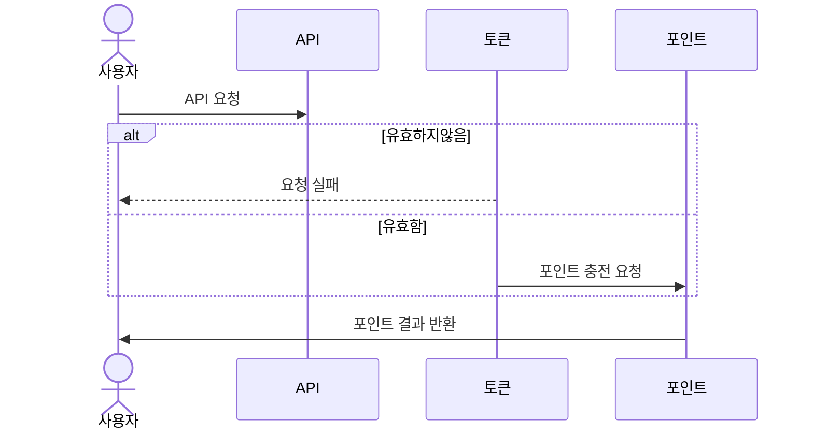
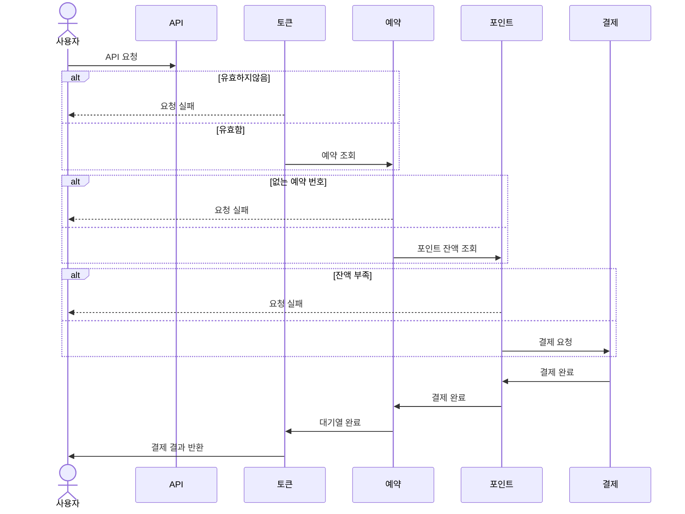

# 콘서트 예약 서비스

# step13,14 보고서
# 캐싱 처리

## 전체 API 종류

- ~~토큰 발급~~
- ~~토큰 리프레시~~
- ~~포인트 조회~~
- ~~잔액 충전~~
- 콘서트 날짜 조회
- ~~콘서트 좌석 정보 조회~~
- ~~콘서트 좌석 예약~~
- ~~결제 요청~~

### 캐싱 처리시 고려해야할 요소

1. **데이터베이스 쿼리 결과**
    - **빈번하게 요청되는 데이터**: 자주 조회되지만 잘 변하지 않는 데이터.
    - **복잡한 쿼리 결과**: 계산이나 집계가 복잡한 쿼리 결과를 캐싱.
2. **API 응답**
    - **자주 호출되는 API 응답**: 동일한 요청에 대해 동일한 응답을 반환하는 경우.
    - **외부 서비스 응답**: 외부 API 호출 결과, 외부 데이터 제공자의 응답.
3. **동적 콘텐츠**
    - **세션 데이터**: 사용자 세션에 따라 다를 수 있는 정보.
    - **사용자 맞춤형 데이터**: 특정 사용자에 대한 맞춤형 콘텐츠.
4. **계산 결과**:
    - **비용이 많이 드는 계산 결과**: 계산이 복잡하거나 시간이 많이 걸리는 결과.
    - **알고리즘 결과**: 특정 알고리즘에 의해 생성된 데이터.
5. **리소스 요청**
    - **검색 쿼리 결과**: 특정 검색어에 대한 결과.
    - **정렬 및 필터링된 리스트**: 대규모 데이터셋에서의 필터링된 결과.
6. **네트워크 요청**:
    - **API 호출 캐싱**: 서버 간 API 요청 결과를 캐싱.
    - **서버 간 데이터 동기화**: 다양한 서버 간의 데이터 동기화 및 캐싱.

### 콘서트 날짜 조회  API

- 변경 빈도 : 낮음
- 호출 빈도 : 높음
- 데이터의 신선도와 메모리 효율성을 위해 TTL 을 1시간으로 설정
- 구현 로직
    - 캐시 조회
        - 있으면 캐시 데이터 리턴
        - 없으면 DB 조회 및 캐시 설정
- 테스트 결과
    - 1번 캐시 없는 상태 → 응답 시간 88ms
    - 그외 캐시 있는 상태 → 응답 시간 평균 22ms 소요
  

---

# Step14

## **API 목록**

- 토큰 발급
    - POST /token
        - Request: userId,
        - Response: token(대기순번, 상태)
    - 구현 로직
        1. 현재 메모리 상태를 확인 대기 여부 판단
        2. 메모리가 일정 수치
            1. 이하면 활성
            2. 초과면 대기열 삽입
        3. 해당 상태에 대한 토큰 리턴
- 토큰 리프레시
    - GET /token/refresh
        - Header: token
        - Response: token(대기순번, 상태)
    - 구현 로직
        - 가드를 통과했다는 기준 → 토큰 존재
        - 토큰의 status 가
            - 활성 상태면 TTL 연장
            - 대기 상태면
                - Active 에 있는지 확인
                    - 있다면 status 를 활성 상태로 변경
                    - 없다면 대기번호 조회
        - 새로운 토큰 발급하여 리턴
        -

→ Guard 를 통해 토큰 상태를 확인 및 처리

- 포인트 조회
- 잔액 충전
- 콘서트 날짜 조회
- 콘서트 좌석 정보 조회
- 콘서트 좌석 예약
- 결제 요청
    - 구현 로직
        - status가 대기나 만료 상태면 에러 발생
        - Active 에서 검색하여 없으면 만료
        - 만료  안됐다면 TTL 연장

대기 상태에서 활성 상태로 변경하기 위한 스케쥴 로직 구현

- 구현 로직
    - 일정 인원씩 대기열에서 호출
    - 해당 유저 활성 상태로 변경
    - 대기열에서 삭제
- 몇명씩 인원을 변경할지에 대한것은 부하 테스트 이후 계산 필요

## Step11
> https://ryanwolf.notion.site/11-c49afa0ae0ba42d3a5fa77a579027255?pvs=4

## Milestone

> https://ryanwolf.notion.site/87ca3ab5e48e43f4bfb8ccd3f43784cd?v=101604bb36ac4b8081a4382b76c39bc9&pvs=4

## API 명세서
> https://ryanwolf.notion.site/API-3078289affc84517b75fd1c11590e3b1?pvs=4

## 시퀸스 다이어그램 작성
### 토큰 발급 API [POST] /client/token

### 콘서트 예약 가능 날짜 조회 API [GET] /concerts/{concertId}/dates

### 콘서트 좌석 정보 조회 API [GET] /concerts/{concertId}/dates/{concertDateId}/seats

### 콘서트 좌석 예매 API [POST] /reservation

### 잔액 조회 API [GET] /client/{clientId}/balance

### 잔액 충전 API [PATCH] /user/{userId}/charge

### 결제 요청 API [POST] /payment/{paymentId}

## ERD
 
